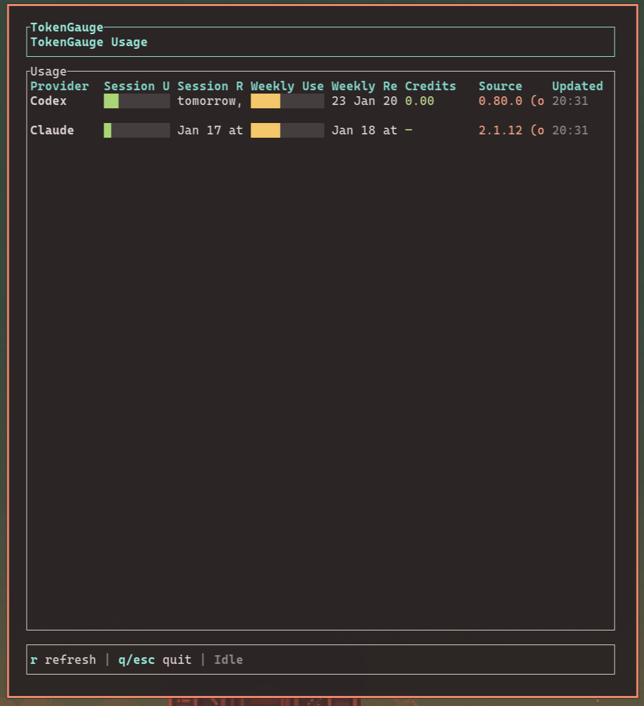
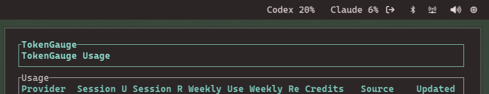

# TokenGauge

TokenGauge keeps Codex and Claude usage visible on Linux. It pairs a Waybar module with a fast TUI dashboard, backed by CodexBar CLI and a local cache.



## Highlights

- Compact Waybar status with cached usage
- TUI dashboard with colored bars and reset times
- OAuth source for Codex and Claude on Linux
- Configurable refresh cadence to avoid extra API calls



## Quick install

```bash
curl -fsSL https://raw.githubusercontent.com/oorestisime/TokenGauge/main/scripts/install.sh | bash
```

This downloads the latest release binaries, installs them to `~/.local/bin`, writes `~/.config/tokengauge/config.toml`, and patches your Waybar config (with a backup). Requires `jq`.

## Manual install

1. Download the latest release tarball for your architecture from GitHub Releases.
2. Extract and install the binaries:

```bash
tar -xzf tokengauge-<tag>-linux-<arch>.tar.gz
install -m 0755 tokengauge-waybar ~/.local/bin/tokengauge-waybar
install -m 0755 tokengauge-tui ~/.local/bin/tokengauge-tui
```

3. Create the config:

```bash
mkdir -p ~/.config/tokengauge
cp crates/tokengauge-core/config.example.toml ~/.config/tokengauge/config.toml
```

4. Add the Waybar module (example below) to your `modules-right` and config block:

```jsonc
"modules-right": ["custom/tokengauge", "group/tray-expander", "bluetooth", "network", "pulseaudio", "cpu", "battery"],
"custom/tokengauge": {
  "exec": "tokengauge-waybar",
  "return-type": "json",
  "interval": 60,
  "on-click": "omarchy-launch-or-focus-tui tokengauge-tui"
}
```

Restart Waybar:

```bash
omarchy-restart-waybar
```

## Supported providers

TokenGauge currently supports Codex and Claude via CodexBar CLI `oauth` on Linux. Other providers are not yet supported on Linux because CodexBar relies on web or API strategies.

## Binaries

- `tokengauge-waybar` - Waybar JSON module. Fetches CodexBar usage, writes cache, renders text/tooltip.
- `tokengauge-tui` - TUI dashboard that reads the cache file.

## Config

Copy the example config and edit:

```bash
mkdir -p ~/.config/tokengauge
cp crates/tokengauge-core/config.example.toml ~/.config/tokengauge/config.toml
```

Key fields:

- `codexbar_bin` - Path to CodexBar CLI
- `source` - `oauth` (Codex and Claude)
- `refresh_secs` - cache refresh interval (network calls)
- `cache_file` - where the Waybar module writes JSON
- `providers.codex` / `providers.claude` - enable or disable providers

Note: Waybar `interval` controls UI refresh. Keep it shorter than `refresh_secs` so the UI updates without extra API calls. The installer patches your Waybar config with jq, so `config.jsonc` must be valid JSON (no comments).

## Waybar module example

```jsonc
"custom/tokengauge": {
  "exec": "tokengauge-waybar",
  "return-type": "json",
  "interval": 60,
  "on-click": "omarchy-launch-or-focus-tui tokengauge-tui"
}
```

Optional spacing in `~/.config/waybar/style.css`:

```css
#custom-tokengauge {
  margin-right: 10px;
}
```

Restart Waybar:

```bash
omarchy-restart-waybar
```

## TUI

```bash
tokengauge-tui
```

Keys:

- `r` refresh
- `q` or `esc` quit

## Updates

- Update TokenGauge binaries:
  ```bash
  curl -fsSL https://raw.githubusercontent.com/oorestisime/TokenGauge/main/scripts/update.sh | bash
  ```
- Update CodexBar CLI:
  ```bash
  curl -fsSL https://raw.githubusercontent.com/oorestisime/TokenGauge/main/scripts/update-codexbar.sh | bash
  ```
